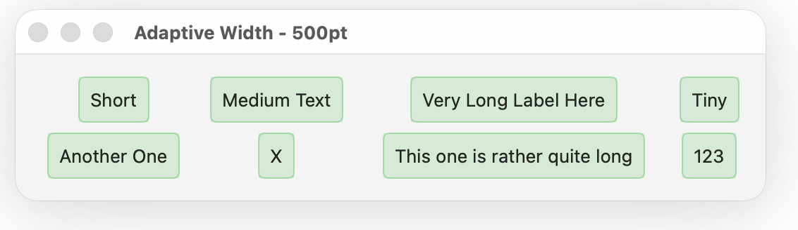
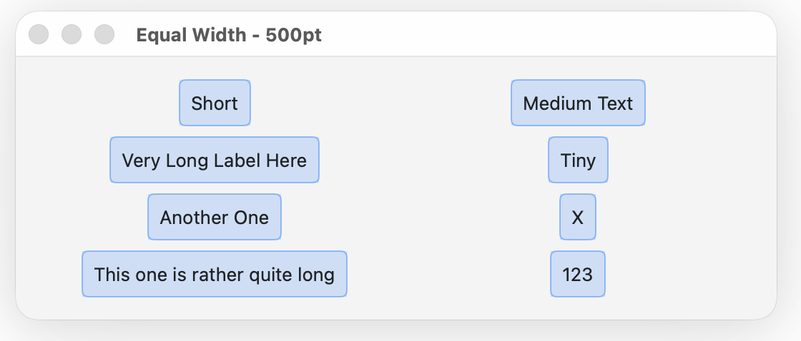

# AdaptiveGrid

A SwiftUI layout container that automatically arranges views in an adaptive grid with equal row heights.

Claude Code did pretty much all the actual engineering.  Time for me to go into retirement?

## Features

- **Adaptive Column Layout**: Automatically determines optimal number of columns based on available width
- **Equal Row Heights**: All rows maintain the same height (based on tallest item)
- **Two Layout Modes**:
  - **Adaptive Width**: Each column adapts to its widest content
  - **Equal Width**: All columns have identical width
- **Proportional Stretching**: Fills available width by stretching columns proportionally
- **Customizable Spacing**: Configure horizontal and vertical spacing
- **Alignment Support**: Supports all SwiftUI alignment options

## Visual Examples

### Adaptive Width Mode
Each column adapts to its widest content, then stretches proportionally to fill available width:



### Equal Width Mode
All columns have identical width based on the widest item:



## Requirements

- iOS 16.0+ / macOS 13.0+
- Swift 5.10+
- Xcode 16.0+ (for building; uses `@Entry` macro from iOS 18 SDK)

### Why iOS 16+ / macOS 13+?

AdaptiveGrid uses SwiftUI's `Layout` protocol, which was introduced in iOS 16 / macOS 13. This protocol enables the custom layout algorithm that automatically determines optimal column counts and handles proportional stretching.

### Why Xcode 16+?

While the package targets iOS 16+ for **runtime** compatibility, it requires Xcode 16 to **build** because it uses the `@Entry` macro (from iOS 18 SDK) for environment values. The `@Entry` macro generates backward-compatible code, so the compiled library runs on iOS 16+ even though it's built with a newer SDK.

## Installation

### Swift Package Manager

Add AdaptiveGrid to your project:

```swift
dependencies: [
    .package(url: "https://github.com/danwood/AdaptiveGrid.git", branch: "main")
]
```

Or in Xcode: **File → Add Package Dependencies**, then enter the repository URL:
```
https://github.com/danwood/AdaptiveGrid.git
```

## Usage

### Basic Example

```swift
import AdaptiveGrid

AdaptiveGrid {
    ForEach(items) { item in
        ItemView(item)
    }
}
```

### Equal Width Mode

Apply the `.equalWidth()` modifier to make all columns the same width:

```swift
AdaptiveGrid {
    Text("Short")
    Text("Medium Length")
    Text("Very Long Text Here")
}
.equalWidth()
```

### Custom Spacing

Configure horizontal and vertical spacing:

```swift
AdaptiveGrid(horizontalSpacing: 16, verticalSpacing: 12) {
    ForEach(tags, id: \.self) { tag in
        TagView(tag)
    }
}
```

### Custom Alignment

```swift
AdaptiveGrid(alignment: .leading, horizontalSpacing: 8, verticalSpacing: 8) {
    // Content
}
```

## How It Works

### Adaptive Width Mode (Default)

The layout engine:
1. Measures all subviews to get their natural sizes
2. Iterates through possible column counts (1, 2, 3, ...)
3. For each column count, calculates the width needed for each column (widest item in that column)
4. Selects the largest column count where the total width fits
5. Stretches columns proportionally to fill available width

### Equal Width Mode

When `.equalWidth()` is applied:
1. Finds the widest subview
2. Calculates how many equal-width columns can fit
3. Distributes extra space equally across all columns

### Row Heights

All rows have the same height, determined by the tallest subview in the entire grid. Items are positioned within cells according to the specified alignment.

## Best Practices

### Single-Line Content

AdaptiveGrid is optimized for **single-line content** such as tags, labels, buttons, and icons. The layout algorithm measures each subview's natural size to determine column widths, which works best when content has a predictable, fixed size.

### Word-Wrapping Text

AdaptiveGrid is **not recommended for word-wrapping text** or content that dynamically changes height based on available width. Because the layout algorithm uses natural (unspecified) sizes for measurement, word-wrapping text will:
- Not wrap correctly within column widths
- Potentially overflow or truncate
- Not reflow properly when the container resizes

For multi-line or word-wrapping content, consider using SwiftUI's built-in `Grid`, `LazyVGrid`, or `FlowLayout` instead.

## Examples

Check out the comprehensive previews in `AdaptiveGrid+Previews.swift` for examples including:
- Tag clouds
- Mixed content (text, buttons, images)
- Different alignment options
- Fixed-size content
- Various container widths

## License

MIT License - see LICENSE file for details
